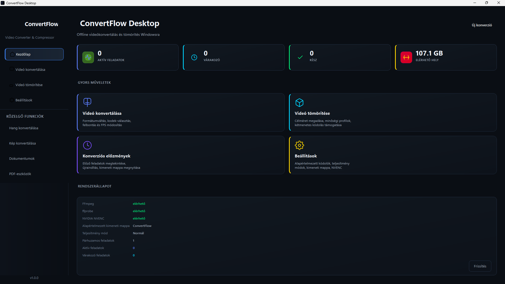

# 🚀 ConvertFlow Desktop

Modern offline videókonvertáló és tömörítő Windowsra.


## ✨ Funkciók

[](https://github.com/horvath3/ConvertFlowDesktop/releases)
[](https://www.python.org/downloads/)
[](https://pypi.org/project/PySide6/)
[](https://ffmpeg.org/)
[](LICENSE)
[](https://www.microsoft.com/windows)

✅ Videó konvertálás  
✅ Videó tömörítés  
✅ NVIDIA NVENC gyorsítás  
✅ FFmpeg 7.0 beépítve  
✅ Modern Dark UI  
✅ Portable verzió  
✅ Windows 10/11 támogatás


## 📸 Képek




## 💻 Telepítés

1. Töltsd le a legújabb verziót:
   
   Releases → ConvertFlow Desktop

2. Csomagold ki a ZIP fájlt

3. Indítsd el:
ConvertFlowDesktop.exe

🎬 Használat
Videó konvertálása
Nyisd meg a Videó konvertálása menüpontot
Válaszd ki a bemeneti videófájlt
Állítsd be:
kimeneti formátum
videókodek
felbontás
FPS
Nyomd meg a Konvertálás indítása gombot
Videó tömörítése
Nyisd meg a Videó tömörítése oldalt
Válaszd ki a célméretet vagy minőségi profilt
Indítsd el a tömörítést

⚡ Hardveres gyorsítás

A ConvertFlow Desktop támogatja az NVIDIA NVENC gyorsítást.

Előnyök:

gyorsabb feldolgozás
kisebb CPU terhelés
hatékonyabb videókódolás

🛠️ Technológiák

Technológia	Használat
Python 3.12	Alkalmazás alap
PySide6	Modern Windows UI
FFmpeg 7.0	Videófeldolgozás
NVIDIA NVENC	GPU gyorsítás
PyInstaller	EXE készítés

📋 Rendszerkövetelmények

Minimum:

Windows 10 64-bit
4 GB RAM
1 GHz processzor

Ajánlott:

Windows 11 64-bit
8 GB+ RAM
NVIDIA GPU NVENC támogatással
📦 Letöltés

A legújabb verzió megtalálható:

➡️ GitHub Releases oldalon

🧪 Fejlesztői verzió futtatása

1. Töltsd le a legfrissebb **`ConvertFlowDesktop-<version>-portable.zip`** fájlt a [Releases](https://github.com/horvath3/ConvertFlowDesktop/releases)-ből
2. Csomagold ki egy tetszőleges mappába
3. Futtasd a `ConvertFlowDesktop.exe`-t

Klónozd a repót:

git clone https://github.com/horvath3/ConvertFlow-Desktop.git

Telepítsd a függőségeket:

pip install -r requirements.txt

Indítás:

python main.py
📝 Verziók
v1.0.0

Első stabil kiadás.

Videó konvertálás
Videó tömörítés
FFmpeg integráció
NVENC támogatás
Modern Dark UI
🐛 Hibák jelentése

Találtál hibát?

Nyiss egy Issue-t a GitHub oldalon:

Issues → New Issue

- Python 3.12
- PyInstaller 6.9+
- UPX (optional, for smaller binaries)

---

## ⚙️ Configuration

Settings are stored in `%APPDATA%\ConvertFlow\settings.json`:

```json
{
  "default_output_dir": "C:\\Users\\<user>\\Videos\\ConvertFlow",
  "use_nvenc": true,
  "default_video_codec": "H.264",
  "default_quality_profile": "Jó minőség",
  "default_audio_bitrate": 160,
  "open_folder_after_conversion": false,
  "auto_remove_successful": false,
  "parallel_jobs": 1,
  "performance_mode": "Normál",
  "log_level": "INFO",
  "custom_ffmpeg_dir": ""
}
```

Logs: `%APPDATA%\ConvertFlow\logs\convertflow.log`

---

## 🎮 Usage Guide

### Converting Videos
1. Click **"Videó konvertálása"** in sidebar
2. Drag video files or click **"Fájl hozzáadása"**
3. Choose container (MP4, MKV, etc.)
4. Select codec (H.264, HEVC, AV1, VP9)
5. Pick quality profile or customize
6. Click **"Indít"** on each task or **"Összes várakozó indítása"**

### Compressing Videos
1. Click **"Videó tömörítése"**
2. Choose compression mode:
   - **Minőség alapján** — CRF-based quality
   - **Célfájlméret alapján** — Enter target size (MB/GB), auto-calculates bitrate
   - **Egyéni bitráta alapján** — Manual bitrate control
3. Add videos, start queue

### Performance Modes
| Mode | Threads | CPU Preset | NVENC Preset | Priority |
|------|---------|------------|--------------|----------|
| **Halk / kímélő** | 2 | veryfast | p3 | Idle |
| **Normál** | Auto | medium | p5 | Normal |
| **Gyors** | Auto | fast | p4 | Normal |

---

## 📦 Supported Formats

### Input (via FFmpeg)
MP4, MKV, MOV, AVI, WebM, WMV, M4V, MPEG, MPG, FLV, TS, MTS, M2TS, and more

### Output Containers
| Container | Video Codecs | Audio Codecs |
|-----------|--------------|--------------|
| MP4 | H.264, HEVC, AV1 | AAC, MP3, Opus |
| MKV | H.264, HEVC, AV1, VP9 | AAC, MP3, Opus, Copy |
| MOV | H.264, HEVC | AAC, MP3, Opus, Copy |
| WebM | VP9, AV1 | Opus |
| AVI | H.264 | MP3, Copy |

---

## 🔧 Technical Architecture

```
ConvertFlowDesktop/
├── main.py                    # Entry point
├── app/
│   ├── application.py         # App initialization, theming, icon
│   ├── core/                  # Business logic
│   │   ├── conversion_queue.py    # Task queue management
│   │   ├── conversion_worker.py   # FFmpeg process worker
│   │   ├── ffmpeg_manager.py      # FFmpeg command builder
│   │   ├── ffprobe_manager.py     # Video metadata extraction
│   │   ├── hardware_detection.py  # NVENC detection
│   │   ├── models.py              # Data classes
│   │   ├── performance_profiles.py# Performance presets
│   │   ├── settings_manager.py    # Persistent settings
│   │   ├── target_size_calculator.py # Bitrate calculator
│   │   └── video_profiles.py      # Codec/quality mappings
│   ├── ui/                    # User interface
│   │   ├── main_window.py         # Main window with sidebar
│   │   ├── home_page.py           # Dashboard
│   │   ├── video_converter_page.py # Conversion UI
│   │   ├── video_compressor_page.py # Compression UI
│   │   ├── settings_page.py       # Settings UI
│   │   ├── conversion_item_widget.py # Task item widget
│   │   └── dialogs.py             # Custom dialogs
│   ├── utils/                 # Utilities
│   └── resources/
│       ├── styles/dark.qss      # Premium dark theme
│       └── icons/               # Logo, app icon (ICO, SVG, PNG)
├── tools/ffmpeg/              # FFmpeg binaries (gitignored)
├── ConvertFlowDesktop.spec    # PyInstaller spec
├── build.bat                  # Build script
├── run.bat                    # Development run script
└── requirements.txt           # Python dependencies
```

---

## 🤝 Contributing

1. Fork the repository
2. Create a feature branch: `git checkout -b feature/amazing-feature`
3. Commit changes: `git commit -m 'Add amazing feature'`
4. Push to branch: `git push origin feature/amazing-feature`
5. Open a Pull Request

### Code Style
- Type hints on all functions
- Docstrings for public APIs
- Follow existing patterns in `app/core/` and `app/ui/`

---

## 📄 License

MIT License — see [LICENSE](LICENSE) for details.

---

## 🙏 Acknowledgments

- **[FFmpeg](https://ffmpeg.org/)** — The backbone of all video processing
- **[PySide6](https://wiki.qt.io/Qt_for_Python)** — Qt6 bindings for Python
- **[PyInstaller](https://pyinstaller.org/)** — Python application bundler
- **NVIDIA** — NVENC hardware acceleration

---

## 📞 Support

- **Issues**: [GitHub Issues](https://github.com/horvath3/ConvertFlowDesktop/issues)
- **Discussions**: [GitHub Discussions](https://github.com/horvath3/ConvertFlowDesktop/discussions)


Kérjük add meg:

Windows verzió
hiba leírása
hiba reprodukálásának lépései
képernyőkép (ha van)

⭐ Ha tetszik a projekt, adj egy Star-t a GitHubon!

Ezt egyben be lehet másolni a `README.md` fájlba.  
A következő lépés utána: **képernyőképek (`screenshots/home.png`) hozzáadása**, mert jelenleg a README hivatkozik rájuk, de még nem léteznek
